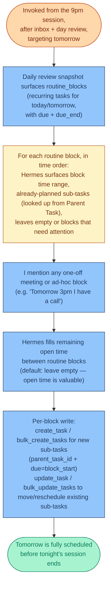

# Daily Plan Phase

Context: [MODES.md](MODES.md) (Execution mode), [mode-trigger-map.md](mode-trigger-map.md)
(Execution + User-initiated), [inbox-processing.md](inbox-processing.md),
[eod-review.md](eod-review.md). This is the scheduling mechanism itself — the algorithm
for turning free time into a realistic, time-blocked schedule. It is **not** a standalone
session: it's invoked as the final step of the single 9pm session
([eod-review.md](eod-review.md)), targeting **tomorrow**, not "today." The outcome is a
realistic schedule that shows up as actual time blocks in Notion Calendar, not a to-do
list.

## How routine blocks work in this model

Routine time-blocks (sleep, study, deep work, workout, meals, etc.) are **recurring
Tasks** with `due` (start time) + `due_end` (end time). They appear directly on the
calendar as long blocks. Things you plan to do inside a routine block become **sub-tasks
of that routine**, via the existing Tasks `Parent Task` self-relation. Concretely:

- Parent task `Study` (recur_interval=1, recur_unit=`Day(s)`, due `06:30+05:30`,
  due_end `07:30+05:30`) → 06:30–07:30 block on the calendar every day
- Sub-task `Solve LA problems 1-15` with `parent_task_id=<Study id>` and `due=06:30+05:30`
  → a regular Task that shows up as a child under Study on Study's page
- Sub-tasks are one-shots, not recurring. The parent's recurrence carries the slot
  forward; new sub-tasks are decided each cycle at the 9 PM session.

The architectural payoff: **each parent block enforces its own slot length via its
`due_end`**. Two sub-tasks that sum to more than the parent's `due_end - due`
can't both fit — Hermes finds this out block-by-block rather than by computing a
free-gap ledger across the whole day.

## The flow

## Per-block discussion protocol

This is the unit of work in the new model — replace the "draft the whole day in one
shot" pattern with a per-block confirmation loop. Each block:

1. Hermes states the **block time range** (from parent's `due`–`due_end`).
2. Hermes lists **already-planned sub-tasks** (from the `routine_blocks` lookup in
   `daily_review_snapshot` — looked up via the `Parent Task` self-relation).
3. You decide per block: keep as-is / add / remove / re-time sub-tasks within the
   block, or move them to a different block.
4. Hermes estimates **fit** (sub-task estimated durations vs. block length).
   Estimate source: `search_work_sessions` history matched against the parent block
   name when available; otherwise a rough 20-min default per sub-task to start.
5. If everything fits: move on. If overflow: state it explicitly per block, offer
   spillover (same routine block tomorrow / Area backlog / drop).

Then loop for the next routine block in time order, then add any ad-hoc one-off
blocks you mention.

## The open time decision

Open time between routine blocks is **deliberately left open** unless you fill it.
Defaulting open avoids the "packed-every-minute fails your own plan" failure mode
the original flow explicitly named. Block-fill decisions are explicit per block;
open time stays open unless you commit something to it.

## What the MCP does at each step

| Step | MCP tool | Notes |
|---|---|---|
| Pull routine blocks + already-planned sub-tasks | `daily_review_snapshot` | `buckets.routine_blocks` for the parents (today + next 7 days), `lookups.routine_blocks[parent_id].planned_subtasks` for already-planned children |
| Find an existing task to reuse as a sub-task | `search_tasks` (with `query`) | Use when you say "the thing I planned for yesterday" |
| Create new sub-tasks for a block | `bulk_create_tasks` with `parent_task_id=<block_id>` and `due=<block due>` | One call per block, or one big call for all blocks at once at commit |
| Re-time a previously-planned sub-task to a different block | `bulk_update_tasks` with `task_id`, `parent_task_id=<new_block_id>`, `due=<new_block due>` | |
| Mark a planned sub-task irrelevant | `archive_item` or `complete_task` (when trivial) | |
| Fetch duration history for a block's planned work | `search_work_sessions(task_id=<sub_task_id>)` | Used for fit estimation |

## Why this model replaces the free-gap computation

The old flow told Hermes to read tomorrow's routine blocks, subtract their `due`–`due_end`
from the day's total, and propose non-routine items into the remainder. Three failures
came out of that model:

- **Calendar accuracy drifts.** Every 9 PM session, the same free-gap math has to be
  redone, and a 5-min drift in any block cascades through the day.
- **Overflow is detected only at the day level**, not the block level — so "Study
  block is 30 min over" gets reported as "the day is 30 min over," which is harder
  to act on.
- **Items in My Day have no calendar slot unless the 9 PM session assigns one**;
  if the session is skipped, the day has no structure. The sub-task-of-routine
  model makes the *routine* the structure — sub-tasks fill it or don't, but the
  skeleton is always there.

The new model trades global optimization for **structural correctness**: the routine
blocks are the calendar; non-routine work has to land inside one of them or in
explicitly-admitted open time. This matches the way Ultimate Brain's calendar view
actually shows your day, not the way a planning algorithm would assign times.

## The overflow case

Per-block overflow reporting only. When a block's planned sub-tasks sum to more than
its `due_end - due` (modulo the fit estimate), Hermes says so for that specific
block, not the day as a whole. Per-block options:

- **Within-block reorder**: swap two sub-tasks, see if a shorter one can come
  earlier when you have more energy.
- **Spillover to next cycle**: move a sub-task to the next occurrence of the same
  routine block (e.g. tomorrow's Study block). This is the natural default for
  "I'm one problem-set behind today."
- **Area backlog**: move a sub-task to the parent project's ongoing backlog by
  clearing its `due` and `parent_task_id`. Done for things that don't actually
  belong in the routine block.
- **Drop**: archive it. Last resort.

You pick. Hermes doesn't decide.

## A routine without sub-tasks

If a routine block has no planned sub-tasks, Hermes surfaces it as
*"Study block is empty, want to put something in?"* — rather than letting it
silently pass. The empty case is the most common reason the 9 PM ritual loses
its grip: the day has structure (the calendar shows the blocks), but the blocks
have no commitments inside them, so the day is whatever happens.

The prompt handles this explicitly, block by block, so the answer to "is there
anything in Study tomorrow" is always a yes/no you just decided, not an
assumption.

## Open technical question, not yet verified

When a recurring parent task completes (via `complete_task`), Notion's `Next Due`
formula advances it. With the Tier 2 `complete_task` `due_end`-preservation fix
in place, the time-block length carries forward automatically — but **only for
the parent**. The sub-tasks you planned for yesterday's Study block are NOT
carried forward; they're one-shots tied to that specific yesterday's date. So
the 9 PM session always starts from "what did you plan last night?" not "what
did you do last night and is still relevant?" — those are different questions
and the model intentionally answers the former.

If you want sub-tasks to also have a built-in carry-forward if not completed,
that would require either (a) duplicating them via `bulk_create_tasks` at the
start of each cycle, or (b) giving each sub-task its own recurrence tied to the
parent's. Option (a) is what the 9 PM pass already does as part of its normal
flow, so the missing carry-forward is a feature, not a bug.

## Status

Working model for the scheduling mechanism, now invoked from within
[eod-review.md](eod-review.md) rather than as its own session. Replaces the
"compute free gaps" framing with a "blocks own their slots; sub-tasks fill
them" model. Execute (the event-triggered, mostly-silent middle of the day)
is the one piece of the daily cycle still undocumented.
