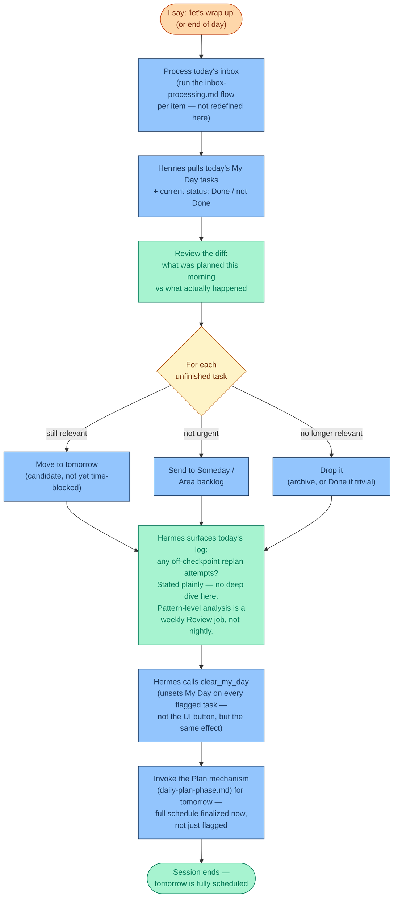

# The 9pm Session (Inbox + Review + Tomorrow's Plan)

Context: [MODES.md](MODES.md), [inbox-processing.md](inbox-processing.md),
[daily-plan-phase.md](daily-plan-phase.md). This is the **one daily session** —
9pm, ~30 minutes — that does everything: clears today's inbox, reviews how the day
actually went, and finalizes tomorrow's full schedule, including real time blocks.
Deliberately merged from what were three separate touchpoints, specifically to reduce
the number of daily rituals to maintain. It still touches three different modes back to
back (processing is Execution, reviewing is Review, scheduling is Execution again) —
that's intentional composition, not the mode boundary collapsing. The parts stay
sequential and distinct: process first, reflect second, schedule last — never blended
into one undifferentiated conversation.

**Deliberate tradeoff, decided and accepted**: finalizing tomorrow's time blocks at 9pm
tonight means the schedule is built from tonight's state, not tomorrow morning's actual
state — something could change overnight that the plan won't know about. This was raised
explicitly and the call was made anyway, in favor of one session over two. If this
turns out to cause repeated friction in practice, it's the first thing to revisit.

## Why combine these three

Ultimate Brain's own "Getting Started" guide already recommends bundling inbox processing
and a daily review into one sitting — this isn't inventing a new habit, it's matching the
documented recommended pattern rather than the "process continuously all day" version
[inbox-processing.md](inbox-processing.md) describes as the ideal. Tomorrow's plan joins
the same sitting by explicit choice: one 30-minute anchor a day instead of splitting
attention across a morning and an evening touchpoint — directly serves the whole point of
this project, reducing the number of places a plan can quietly get re-opened.

## Three things worth being explicit about

**The three parts stay sequential, not blended.** Process the inbox first (mechanical,
Execution-mode rules apply — no re-litigating priorities mid-processing), then review the
day (reflective, Review-mode rules apply), then schedule tomorrow (mechanical again, via
[daily-plan-phase.md](daily-plan-phase.md)'s own flow, not redefined here). If these blend
into one undifferentiated conversation, this session risks becoming exactly the kind of
scope-creeping session this whole project exists to prevent.

**Nightly review stays light — pattern work is weekly.** Surfacing "did anything get
logged today" is a quick, plain statement, not an investigation. The deeper "3+ logged
replan attempts with the same trigger" pattern-detection work belongs to the weekly
Review cadence (per [mode-trigger-map.md](mode-trigger-map.md)), not every night. Doing
deep analysis nightly would turn this session into a second Planning session in disguise.

**Tomorrow's schedule is finalized tonight, on purpose.** Unfinished-task triage
(reschedule / Someday / drop) feeds directly into the same Plan mechanism that runs next —
whatever's still relevant becomes an input to tomorrow's schedule, computed and committed
in the same sitting rather than deferred. See the tradeoff note at the top of this file:
this trades morning-of freshness for one session instead of two, deliberately.

## Status

Working model, now the single daily anchor. Execute mode (the largely-silent,
event-triggered middle of the day) is the one piece of the daily cycle still undocumented.
