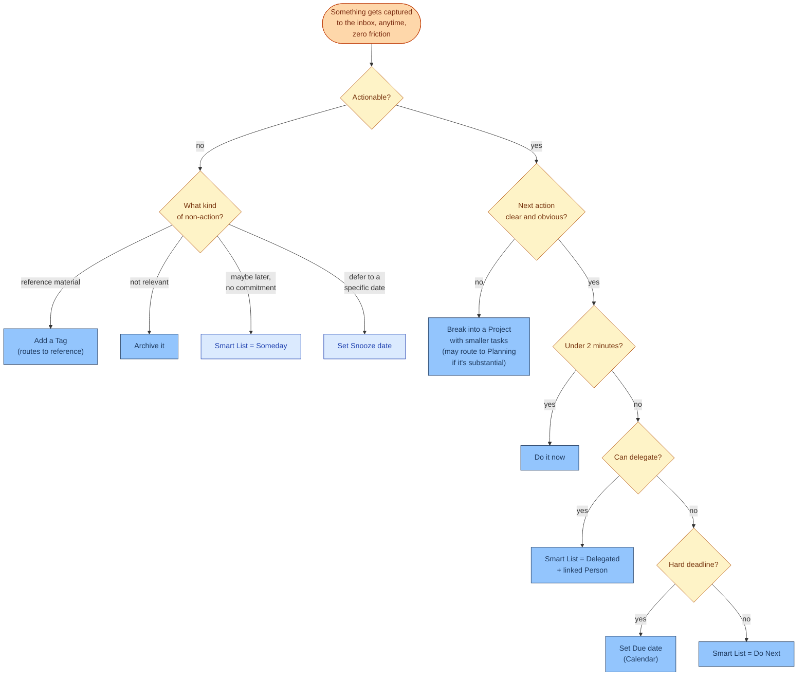

# Inbox Processing

Context: [MODES.md](MODES.md) (Execution mode, "quick capture + processing"),
[PURPOSE.md](PURPOSE.md). This is the mechanism that prevents the "did I forget
something" problem from ever reaching Plan or Execute in the first place — instead of
periodically re-scanning old views hoping to rediscover things, every captured item gets
routed to a proper destination close to when it's captured, GTD's "process to zero"
principle.

## The refinement that matters most

**Someday and Snoozed are deliberate holding pens, not processing failures.** Routing
something there and not seeing it again until deliberately revisited is the *correct*
outcome for things that genuinely aren't due yet — it isn't a gap to be patched by
re-scanning old views. The right place to revisit them is:

- **Snoozed** items resurface automatically on their snooze date — no action needed.
- **Someday** items get revisited through the **Area backlog** mechanism in
  [planning-mode.md](planning-mode.md), or through the weekly Review — not a daily
  re-scan tacked onto Plan.

This is what actually retires the "skim through 10 views hoping to remember something"
habit: not by replicating the visual scan conversationally, but by making sure nothing
sits unprocessed long enough to need rediscovering. A newly-remembered task that genuinely
wasn't captured yet still gets handled the normal way — captured, then processed through
this same flow — it just shouldn't be a *routine* occurrence once processing is
consistent.

## Technical note

`update_task` exposes `status`, `due`, `priority`, `project_id`, `labels`, `my_day`,
`parent_task_id`, `tag_ids`, `location`, `enforce_schedule` — but **not** `Smart List` or
`Snooze` directly. Routing an item to Do Next / Delegated / Someday, or setting a Snooze
date, requires falling back to the generic `update_page` tool (arbitrary property
coercion) rather than a first-class task-tool parameter. Not a blocker, just means this
mechanism isn't fully wired through the dedicated Tasks tools today.

## Status

Working model. Feeds directly into [planning-mode.md](planning-mode.md)'s Area-backlog
entry point and the daily Plan flow (next up).
