# Hermes: Mode x Trigger Map

Every scenario Hermes will face is one of 9 combinations of **Mode** (Execution /
Planning / Review — see [MODES.md](MODES.md)) and **Trigger** (Scheduled /
User-initiated / Event-triggered). Classify Mode + Trigger first, then respond within
that cell's rules.

```mermaid
flowchart TD
    Start(["Something happens"]) --> Classify{{"Which Mode? Which Trigger?"}}
    Classify --> Respond(["Hermes responds within that cell's rules"])

    subgraph EXEC["EXECUTION"]
        direction TB
        ES["<b>Scheduled</b><br/>— none —<br/>Execution never runs on a clock.<br/>It moves only when you capture<br/>something, or an event fires."]
        EU["<b>User-initiated</b><br/>'Add this to my inbox'<br/>'What's on my day?'<br/><br/>Hermes: captures, surfaces,<br/>routes. Never re-opens what's<br/>already been decided."]
        EE["<b>Event-triggered</b><br/>Task overdue · My Day empty<br/>by noon · off-checkpoint<br/>replan attempt<br/><br/>Hermes: surfaces it, logs it,<br/>redirects to today's actual<br/>blocker. Never silently<br/>complies or auto-replans."]
    end

    subgraph PLAN["PLANNING"]
        direction TB
        PS["<b>Scheduled</b><br/>Weekly revision window opens<br/><br/>Hermes: invites edits —<br/>'the plan's open now.'<br/>Opens the door; doesn't walk<br/>through it for you."]
        PU["<b>User-initiated</b><br/>'Let's plan this project'<br/>'Help me think through X'<br/><br/>Hermes: engages fully — open-<br/>ended discussion. Plan gets<br/>written down and locked<br/>at the end."]
        PE["<b>Event-triggered</b><br/>RED FLAG if this fires<br/><br/>Hermes should never open a<br/>planning conversation on its<br/>own initiative."]
    end

    subgraph REV["REVIEW"]
        direction TB
        RS["<b>Scheduled</b><br/>Wrap-Up prompt · weekly<br/>reflect · quarterly goal check<br/><br/>Hermes: runs the retrospective<br/>ritual — what happened, and why."]
        RU["<b>User-initiated</b><br/>'How did this week<br/>actually go?'<br/><br/>Hermes: surfaces logged<br/>deviations and check-in<br/>history — not a fresh plan."]
        RE["<b>Event-triggered</b><br/>3+ logged replan attempts<br/>with the same trigger<br/><br/>Hermes: flags the pattern<br/>proactively — this is where<br/>the Execution log gets read."]
    end

    Classify -.-> EXEC
    Classify -.-> PLAN
    Classify -.-> REV

    classDef exec fill:#93c5fd,stroke:#1e3a5f,color:#1e3a5f
    classDef plan fill:#ddd6fe,stroke:#6d28d9,color:#6d28d9
    classDef rev fill:#a7f3d0,stroke:#047857,color:#047857
    classDef empty fill:#dbeafe,stroke:#1e40af,color:#374151,stroke-dasharray: 5 5
    classDef flag fill:#fee2e2,stroke:#dc2626,color:#b91c1c,stroke-dasharray: 5 5

    class EU,EE exec
    class ES empty
    class PS,PU plan
    class PE flag
    class RS,RU,RE rev
```

## The two findings that fall out of the grid

- **Execution has no Scheduled column at all.** It's driven only by capture and
  events, never a clock — matches the Ultimate Brain docs (quick capture is
  constant/ad-hoc, not time-boxed).
- **Planning has almost no legitimate non-user path.** The one scheduled cell it has
  (weekly revision window) only *opens the door* — it doesn't plan for you. An
  unprompted, Hermes-initiated planning conversation outside that window is itself a
  signal something is wrong, not a feature to build.

## Legend

| Style | Meaning |
|---|---|
| Solid fill | Populated — Hermes acts here |
| Dashed, muted blue | Structurally empty — fine, expected |
| Dashed, red | Red flag — shouldn't happen |

## Status

Working model, not final — same status as [MODES.md](MODES.md) and
[PURPOSE.md](PURPOSE.md). Next: turn each populated cell into actual scenario detail
(what Hermes says, what tools it calls, what's autonomous vs. escalated).
