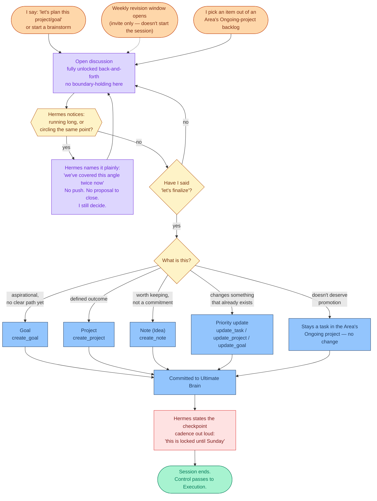

# Planning Mode

Context: [MODES.md](MODES.md), [mode-trigger-map.md](mode-trigger-map.md). This is the
detailed flow for Planning specifically — the mode with the most exposure to the
perfectionism/paralysis pattern this whole project exists to address, so it gets worked
out first.

## The two decisions this locks in

**Convergence is entirely mine to call, not Hermes's** — with one exception: Hermes is
allowed to *name* what it observes (a long session, the same tradeoff being re-litigated)
as information, never as pressure or a proposal to close. A named blind spot beats a
silent one, but the actual decision to finalize stays mine. This was a deliberate choice
against the "time-box" and "Hermes judges diminishing returns" alternatives — those hand
the closing decision to Hermes, which risks either being too soft (easy to argue past) or
too rigid (forcing closure on a plan that's genuinely not ready). Worth revisiting if
"only when I say so" turns out to just reproduce the old pattern with better vocabulary.

**Everything that comes out of a Planning session gets locked** — a captured idea, a new
Note, a Project, a Goal, all of it. No exceptions carved out for "low-stakes" captures.
Simpler rule, and it means Hermes never has to make a judgment call about what counts as
a real commitment vs. a casual one — which removes a place for the plan-drift loophole to
hide.

## What "classify" actually branches into

- **Goal** — aspirational, no fully-known path yet (`create_goal`)
- **Project** — a defined outcome (`create_project`)
- **Note (Idea)** — worth keeping, not yet a commitment to act (`create_note`, type
  Idea — subject to the novelty-gate rule in the `ub` skill)
- **Priority update** — the session concluded by changing something that already exists,
  not creating something new (`update_task` / `update_project` / `update_goal`)
- **Stays as-is** — the discussion concluded the item doesn't deserve promotion; it stays
  a task in the Area's Ongoing project. This is a legitimate outcome, not a failure to
  converge — not every backlog item needs to become a Project or Goal.

## Area backlogs as a planning source

Every Tag/Area has an Ongoing project (the UB docs' own recommended pattern for
associating tasks with an Area, since Tasks has no direct relation to Tags). That
project's task list is the backlog for that area of life — things that matter to the area
but haven't been shaped into a defined outcome yet. Planning sessions can start there:
pick an item out of an Area's Ongoing-project backlog, discuss it, and either promote it
(Project/Goal/Note) or leave it as a task in the backlog. This gives Planning a concrete
starting point beyond "what do I feel like planning today" — the backlog is where
half-formed intentions already live, waiting to be picked up deliberately instead of
nagging quietly in the background.

## Status

Working model for Planning mode specifically. Execution mode and Review mode still need
the same treatment — this is one of three, not the full picture yet.
